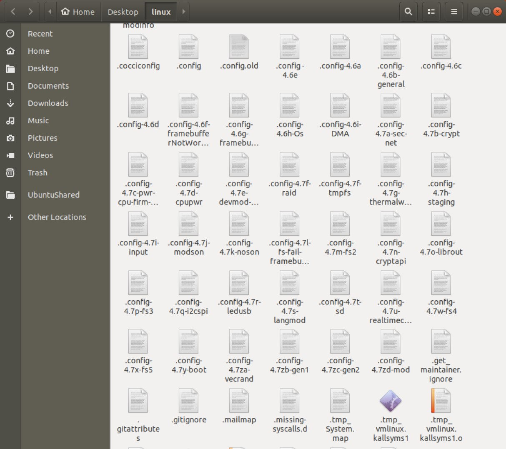
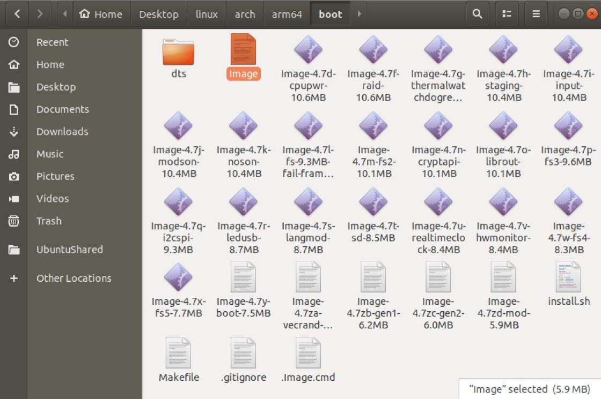

# Lab1 Report

彭浩然 P19051055

## Linux内核

经过多次裁剪，成功编译得到大小不超过6MiB的内核。下图是裁剪过程中保留的不同版本的`.config`文件以及最终得到的内核。

## 初始内存盘

成功运行截图：

完成后没有出现Kernel Panic。

## 初识Boot

修改代码后运行make：

成功添加了`I am OK!`的输出。

### 思考题

- `jmp $` 又是在干什么？

`jmp`是跳转指令，而`$`表示取当前指令自己的地址。这条指令跳转到自己，其实是实现了一个无限死循环，让程序停在此处不继续运行。在程序中，这条指令会在出错的分支下或者所有任务完成后的分支下出现。

- `boot.asm` 文件前侧的 `org 0x7c00` 有什么用？

`org`伪指令表示当前程序将会从内存的某个地址处开始，这里规定了这个程序会被加载到内存的`0x7c00`处。其中`0x7c00`是BIOS规定的启动区加载位置。

## 思考题

1. 请简要解释 `Linux` 与 `Ubuntu`、`Debian`、`ArchLinux`、`Fedora` 等之间的关系和区别。

`Linux`（正确叫法是`GNU/Linux`）内核是一种开源的操作系统内核，严格来讲并不是一个完整的操作系统。`Ubuntu`、`Debian`、`ArchLinux`、`Fedora`等都是基于`Linux`的操作系统的发行版（distribution），是将`Linux`内核与外围应用程序、文档等包装起来，再提供系统相关的一些工具而形成的软件包，可以供用户直接安装使用。

8. 说明 `UEFI Boot` 的流程，截图指出你的某一个系统的 `EFI` 分区中包含哪些文件。

`UEFI Boot`是`BIOS Boot`的一种改进，执行类似的任务：

- 机器上电，运行`UEFI Boot`
- `UEFI`根据预先设定好的顺序，依次遍历每一个`FAT`分区
- 如果在该分区下找到`EFI`引导文件（`\efi\boot\bootia32.efi`或者`\efi\boot\bootx64.efi`，根据32位或64位确定），则执行之
- `EFI`引导文件执行相应的任务后，将控制移交给操作系统，启动完成

在管理员模式下手动挂载`Windows`的隐藏启动分区，并使用`SpaceSniffer`透视其内容：

可以看到关键的`bootx64.efi`。